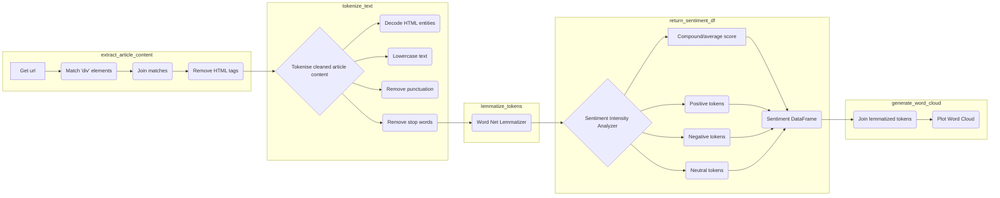

```mermaid
 flowchart LR
   subgraph extract_article_content
        A[Get url] --> B(Match 'div' elements);
        B --> C(Join matches);
        C --> D(Remove HTML tags);
    end

    subgraph tokenize_text
        D --> E{Tokenise cleaned article content};
        E --> F(Decode HTML entities);
        E --> G(Lowercase text);
        E --> H(Remove punctuation);
        E --> I(Remove stop words);
    end

    subgraph lemmatize_tokens
        I --> J(Word Net Lemmatizer);
    end

    subgraph return_sentiment_df
        J --> K{Sentiment Intensity Analyzer};
        K --> L(Positive tokens);
        K --> M(Negative tokens);
        K --> N(Neutral tokens);
        K --> O[Compound/average score];
        O --> P(Sentiment DataFrame);
        L --> P;
        M --> P;
        N --> P;
    end

    subgraph generate_word_cloud
        P --> Q(Join lemmatized tokens);
        Q --> R(Plot Word Cloud);
    end

```
