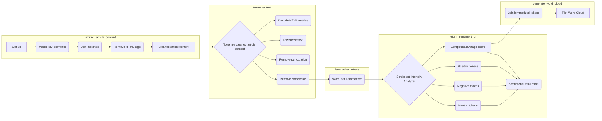

```mermaid
 flowchart LR
   subgraph extract_article_content
        A[Get url] --> B(Match 'div' elements);
        B --> C(Join matches);
        C --> D(Remove HTML tags);
        D --> E[Cleaned article content];
    end

    subgraph tokenize_text
        E --> F{Tokenise cleaned article content};
        F --> G(Decode HTML entities);
        F --> H(Lowercase text);
        F --> I(Remove punctuation);
        F --> J(Remove stop words);
    end

    subgraph lemmatize_tokens
        J --> K(Word Net Lemmatizer);
    end

    subgraph return_sentiment_df
        K --> L{Sentiment Intensity Analyzer};
        L --> M(Positive tokens);
        L --> N(Negative tokens);
        L --> O(Neutral tokens);
        L --> P[Compound/average score];
        P --> Q(Sentiment DataFrame);
        M --> Q;
        N --> Q;
        O --> Q;
    end

    subgraph generate_word_cloud
        P --> R(Join lemmatized tokens)
        R --> S[Plot Word Cloud]
    end
```
